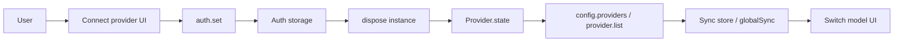

# Model architecture: Connect provider and Switch model

This document explains how **Connect provider** works, how it makes a provider’s models available in **Switch model**, and how the app connects to each provider (no LiteLLM or other general gateway).

---

## 1. Overview

- **Connect provider** stores credentials (API key or OAuth) on the server via `auth.set`. The server merges those credentials into its per-instance provider state.
- Only providers that have credentials (and pass config allow/disable rules) remain in that state and are returned by `provider.list()` and `config.providers`.
- **Switch model** in both the TUI and the web app reads that server data: the list of providers with models comes from the same APIs. So connecting a provider is what makes its models selectable in Switch model.

---

## 2. Connect provider flow

### 2.1 Entry points

- **TUI (CLI)**  
  - Command palette **“Connect provider”** or slash **`/connect`** opens the provider list.  
  - Implemented in [`packages/opencode/src/cli/cmd/tui/app.tsx`](packages/opencode/src/cli/cmd/tui/app.tsx) (command value `provider.connect`) by replacing the dialog with `DialogProviderList` (alias for `DialogProvider`).  
  - [`packages/opencode/src/cli/cmd/tui/component/dialog-provider.tsx`](packages/opencode/src/cli/cmd/tui/component/dialog-provider.tsx) builds the list from `sync.data.provider_next.all` and `sync.data.provider_auth`; the user picks a provider then goes to API key or OAuth.

- **Web app**  
  - Sidebar or command **“Connect provider”** opens the provider picker.  
  - [`packages/app/src/pages/layout.tsx`](packages/app/src/pages/layout.tsx) defines `connectProvider()` which shows `DialogSelectProvider`; the user picks a provider and then [`packages/app/src/components/dialog-connect-provider.tsx`](packages/app/src/components/dialog-connect-provider.tsx) (`DialogConnectProvider`) runs with that provider id.

### 2.2 Storing credentials

- **API key**  
  The client calls `auth.set` with `providerID` and `auth: { type: "api", key }`.  
  - Server: [`packages/opencode/src/server/server.ts`](packages/opencode/src/server/server.ts) (operationId `auth.set`) calls `Auth.set(providerID, info)`.  
  - Credentials are persisted per provider by the Auth layer (e.g. [`packages/opencode/src/auth/index.ts`](packages/opencode/src/auth/index.ts)).

- **OAuth**  
  - Web: `DialogConnectProvider` uses `provider.oauth.authorize` and `provider.oauth.callback`. On success, the server’s [`packages/opencode/src/provider/auth.ts`](packages/opencode/src/provider/auth.ts) `ProviderAuth.callback` calls `Auth.set(providerID, info)`.  
  - TUI: Same SDK endpoints; after a successful callback the TUI calls `sdk.client.instance.dispose()` then `sync.bootstrap()`.

### 2.3 Refreshing UI state after connect

The server caches provider state per instance (directory). So after credentials are stored, the client must trigger a refresh so the next provider/config requests see the new “connected” set.

- **Web**  
  On success, [`packages/app/src/components/dialog-connect-provider.tsx`](packages/app/src/components/dialog-connect-provider.tsx) calls `globalSDK.client.global.dispose()`. That runs `Instance.disposeAll()` and emits `global.disposed`.  
  [`packages/app/src/context/global-sync/event-reducer.ts`](packages/app/src/context/global-sync/event-reducer.ts) handles `global.disposed` by calling `refresh()`, which re-runs global bootstrap in [`packages/app/src/context/global-sync/bootstrap.ts`](packages/app/src/context/global-sync/bootstrap.ts) (e.g. `globalSDK.provider.list()`), updating `globalSync.data.provider` so connected providers and their models appear.

- **TUI**  
  After `auth.set` (and OAuth callback when applicable), the TUI calls `sdk.client.instance.dispose()` then `sync.bootstrap()`.  
  [`packages/opencode/src/cli/cmd/tui/context/sync.tsx`](packages/opencode/src/cli/cmd/tui/context/sync.tsx) bootstrap fetches `config.providers()` and `provider.list()` and writes to `store.provider` and `store.provider_next`, so the Switch model list is updated from the same server data.

---

## 3. Server-side provider and auth

- **Provider state**  
  [`packages/opencode/src/provider/provider.ts`](packages/opencode/src/provider/provider.ts) uses `Instance.state()` to build a single provider map per directory. In that state:
  - The base set comes from `ModelsDev.get()` and config (e.g. `config.provider`).
  - Credentials are merged in: env vars, then `Auth.all()` for API keys, then plugin auth (e.g. OAuth) that calls `Auth.set`. Only providers that end up with credentials and pass `isProviderAllowed` stay in `providers`; others are dropped. So **“connected” = present in this map with credentials.**

- **Provider.list()**  
  [`packages/opencode/src/server/routes/provider.ts`](packages/opencode/src/server/routes/provider.ts) `GET /` returns the result of `Provider.list()` (the same state’s `providers`) plus metadata: `all`, `default`, `connected`. So “connected” here is exactly the set of providers that have auth and thus appear in `Provider.list()`.

- **Config providers (TUI)**  
  [`packages/opencode/src/server/routes/config.ts`](packages/opencode/src/server/routes/config.ts) `GET /providers` (`config.providers`) returns `Provider.list()` as `Object.values(providers)` and default model per provider. So the list of providers with models that the TUI uses for Switch model is the connected set from server state.

**Summary:** Connect provider → `Auth.set` → server stores credentials → `Provider.state()` (after dispose) includes that provider and its models → `config.providers()` / `provider.list()` return that provider → Switch model shows its models.

---

## 4. How the app connects to each provider

The app does **not** use a general proxy like LiteLLM. It talks to each provider via the **Vercel AI SDK** ecosystem: one provider interface, with many per-provider npm packages and one generic “OpenAI-compatible” client for APIs that follow that shape.

- **Bundled providers**  
  In [`packages/opencode/src/provider/provider.ts`](packages/opencode/src/provider/provider.ts), `BUNDLED_PROVIDERS` wires major providers with direct imports from official `@ai-sdk/*` (and a few others): e.g. `@ai-sdk/anthropic`, `@ai-sdk/openai`, `@ai-sdk/google`, `@ai-sdk/openai-compatible`, `@ai-sdk/gateway`, `@openrouter/ai-sdk-provider`, `@ai-sdk/vercel`, `@gitlab/gitlab-ai-provider`, plus a custom GitHub Copilot wrapper. Each entry is a `create*` function that returns an AI SDK Provider instance.

- **OpenAI-compatible as the generic path**  
  Many providers in the model registry use `@ai-sdk/openai-compatible` with a per-provider or per-model `api` URL (and optional env/auth). So one generic client type is used, and different endpoints (and keys) distinguish providers—no separate “LiteLLM layer” in the middle.

- **Custom logic per provider**  
  `CUSTOM_LOADERS` in the same file give some providers extra setup before use: e.g. Anthropic (beta headers), OpenCode (free-tier model filtering), Amazon Bedrock, SAP, GitHub Copilot (plugin auth loader), Cloudflare AI Gateway (uses `ai-gateway-provider`). These run after the base provider is chosen and inject options or replace the loader; they do not replace the overall “AI SDK provider per npm package” design.

- **Dynamic loading for unlisted providers**  
  If a model’s `api.npm` is not in `BUNDLED_PROVIDERS`, the server runs `BunProc.install(model.api.npm, "latest")` and dynamically imports the module’s `create*` function, then instantiates it with provider id and options. So plugins or future providers can ship their own npm package without changing the core bundle.

- **Model registry**  
  [`packages/opencode/src/provider/models.ts`](packages/opencode/src/provider/models.ts) `ModelsDev`, backed by a generated `models.json` in cache, defines for each provider/model the `npm` package (e.g. `@ai-sdk/openai-compatible` or `@ai-sdk/anthropic`), optional `api` URL, env vars, and metadata. Config and Auth then layer on credentials and overrides.

- **LiteLLM only as a compatibility tweak**  
  When the *target* is a LiteLLM (or similar) proxy, the app does one special thing. In [`packages/opencode/src/session/llm.ts`](packages/opencode/src/session/llm.ts), if the provider id or api id contains `"litellm"` or the option `litellmProxy: true` is set, and the message history has tool calls but no active tools, it adds a dummy tool so the proxy’s validation is satisfied. The app does **not** use LiteLLM as the central gateway; it can talk to a LiteLLM-backed endpoint via the normal OpenAI-compatible (or other) provider.

**Summary:** No LiteLLM or other general gateway; Vercel AI SDK providers (bundled + openai-compatible + dynamic); optional per-provider custom loaders; LiteLLM only as client-side compatibility when calling a LiteLLM proxy.

---

## 5. How models become selectable

- **TUI**  
  `DialogModel` in [`packages/opencode/src/cli/cmd/tui/component/dialog-model.tsx`](packages/opencode/src/cli/cmd/tui/component/dialog-model.tsx) reads `sync.data.provider` (from bootstrap’s `config.providers()`). Options are built from `sync.data.provider` (each provider’s `models`). Any provider that appears in `store.provider` after bootstrap has its models selectable (e.g. `providerOptions` from `sync.data.provider`).

- **Web**  
  The model list comes from `useProviders().connected()` in [`packages/app/src/hooks/use-providers.ts`](packages/app/src/hooks/use-providers.ts)—providers whose ids are in `providers().connected`, each with `.models`. That data comes from the same `provider.list()` response (after bootstrap/refresh). So only connected providers (with auth) appear with models.

---

## 6. Data flow diagram

---

## 7. Key files

| Area | File |
|------|------|
| TUI: Connect provider command | `packages/opencode/src/cli/cmd/tui/app.tsx` |
| TUI: Provider list dialog | `packages/opencode/src/cli/cmd/tui/component/dialog-provider.tsx` |
| TUI: Switch model dialog | `packages/opencode/src/cli/cmd/tui/component/dialog-model.tsx` |
| TUI: Sync bootstrap | `packages/opencode/src/cli/cmd/tui/context/sync.tsx` |
| Web: Connect provider entry | `packages/app/src/pages/layout.tsx` |
| Web: Connect provider dialog | `packages/app/src/components/dialog-connect-provider.tsx` |
| Web: Model selector | `packages/app/src/components/dialog-select-model.tsx` |
| Web: Providers hook | `packages/app/src/hooks/use-providers.ts` |
| Web: Global bootstrap | `packages/app/src/context/global-sync/bootstrap.ts` |
| Web: global.disposed handler | `packages/app/src/context/global-sync/event-reducer.ts` |
| Server: auth.set | `packages/opencode/src/server/server.ts` |
| Server: Provider list route | `packages/opencode/src/server/routes/provider.ts` |
| Server: Config providers route | `packages/opencode/src/server/routes/config.ts` |
| Server: Provider state + bundled/custom | `packages/opencode/src/provider/provider.ts` |
| Server: Auth persistence | `packages/opencode/src/auth/index.ts` |
| Server: OAuth flow | `packages/opencode/src/provider/auth.ts` |
| Server: Model registry | `packages/opencode/src/provider/models.ts` |
| LiteLLM proxy compatibility | `packages/opencode/src/session/llm.ts` |
